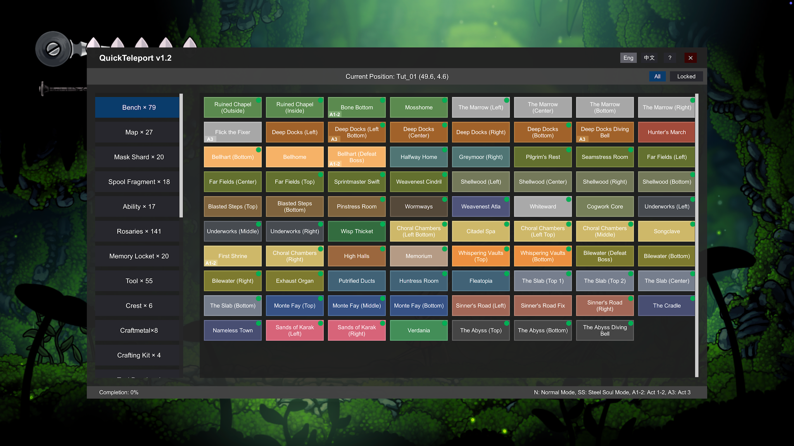

# Silksong-QuickTeleport-Mod

> **English** | [中文](README_zh.md)

A quick teleportation mod for Hollow Knight: Silksong.

## Coordinates

Name | Count
---- | ----
Bench | 79
Map | 27
Mask Shard | 20
Spool Fragment | 18
Ability | 17
Rosary | 141
Memory Locket | 20
Tool | 55
Crest | 6 
Craftmetal | 8
Flea | 30 
Memento | 8
Heart | 4
Psalm Cylinder | 6
Materium | 45
Crafting Kit | 4
Tool Pouch | 4
Key | 12
Pail Oil | 3
Relic | 15
Silkeater | 10
Enemy | 237
NPC | 78
Lore | 40
Needolin | 44
Misc. | 5

## Installation

1. Install `BepInEx`
2. Extract and put the `QuickTeleport.dll` into `BepInEx/plugins/` folder
3. Start game

## Usage

### Keyboard Controls

Default shortcut `Ctrl + = [equal key]`.

### Modify Shortcut

- Modify the hotkeys via the `Configuration Manager`. In the game, press `F1` to open the `Configuration Manager` panel, find `QuickTeleport`, and modify the values ​​for `Alt`, `Control`, `Shift`, and `ToggleUIKey`.

- Alternatively, modify the values ​​for `Alt`, `Control`, `Shift`, and `ToggleUIKey` in the configuration file `100hps.QuickTeleport.cfg`.

## Safety Guidelines

> **⚠️ Important: Please follow these safety guidelines to avoid game bugs and data corruption!**

### When it's safe to use:

* ✅ Only save or teleport when your **character is fully controllable**
* ✅ In **normal game scenes**, when **not in combat**

### Dangerous situations - DO NOT use:

* ❌ **During boss battles**
* ❌ **Inside closed combat areas**
* ❌ **During cutscenes or animations**
* ❌ **When character is controlled or immobilized**
* ❌ **During any special states or triggered events**

### Important Notes:
⚠️ **Do not teleport immediately after death!**

## Credits

The project references this [MOD](https://github.com/Masaicker/TeleportMod-Silksong). Great job!

## Changelog

### 1.3
* Modify shortcut keys.

### 1.2
* Display item acquisition indicator.
* Display game progress.

### 1.1.1
* Update coordinate data.

### 1.1
* Save language setting.
* Fix some incorrect coordinate data.

### 1.0
First release.