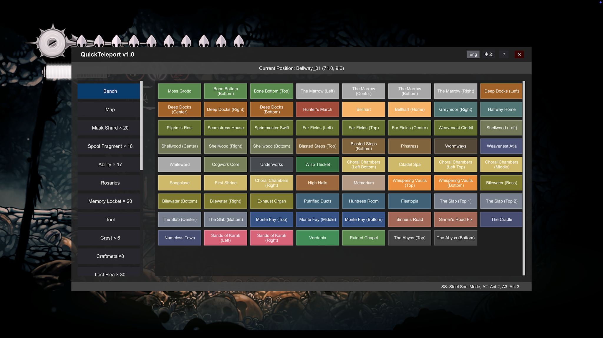

# Silksong-QuickTeleport-Mod

> **English** | [中文](README_zh.md)

A quick teleportation mod for Hollow Knight: Silksong.

## Coordinates

Name | Count
---- | ----
Bench| 71
Map| 25
Mask Shard | 20
Spool Fragment | 18
Ability | 17
Rosaries | 135
Memory Locket | 20
Tool | 51
Crest | 6 
Craftmetal | 8
Flea | 30 
Memento | 8
Psalm Cylinder | 6
Materium | 45
Crafting Kit | 4
Tool Pouch | 4
Key | 12
Pail Oil | 3
Relic | 15
Silkeater | 10
Enemy | 237
NPC | 80
Literature | 36
Needolin | 20

## Installation

1. Install `BepInEx`
2. Extract and put the `QuickTeleport.dll` into `BepInEx/plugins/` folder
3. Start game

## Usage

### Keyboard Controls
- `Ctrl + = [equal key]`: **Open QuickTeleport panel**

## Safety Guidelines

> **⚠️ Important: Please follow these safety guidelines to avoid game bugs and data corruption!**

### When it's safe to use:

* ✅ Only save or teleport when your **character is fully controllable**  
* ✅ In **normal game scenes**, when **not in combat**

### Dangerous situations - DO NOT use:

* ❌ **During boss battles**
* ❌ **Inside closed combat areas**
* ❌ **During cutscenes or animations**
* ❌ **When character is controlled or immobilized**
* ❌ **During any special states or triggered events**

### Important Notes:
⚠️ **Do not teleport immediately after death!**

## Credits

This project references this [MOD](https://github.com/Masaicker/TeleportMod-Silksong). Great job!

## Changelog

### 1.1
* Save language setting.
* Fix some incorrect coordinate data.

### 1.0
First release.