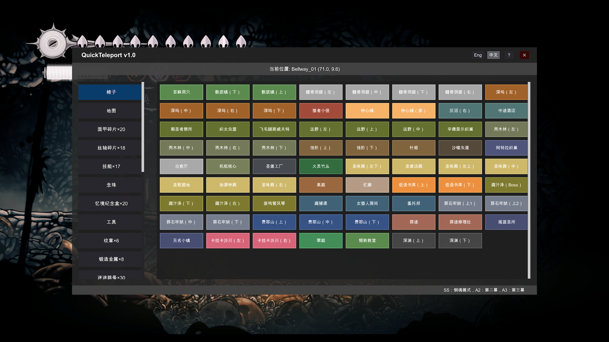

# 丝之歌快速传送模组

> [English](README.md) | **中文**

空洞骑士：丝之歌的快速传送模组。

## 传送坐标

名称 | 数量
---- | ----
椅子| 79
地图| 27
面甲碎片 | 20
丝轴碎片 | 18
技能 | 17
念珠 | 141
忆境纪念盒 | 20
工具 | 52
纹章 | 7
制造金属 | 8
跳蚤 | 30
忆痕 | 8
心 | 4
音筒 | 6
物质 | 45
制作匣 | 4
工具袋 | 4
钥匙 | 12
织针升级 | 3
遗物 | 15
噬丝者 | 10
敌人 | 237
角色 | 78
文献 | 40
织忆弦针 | 44
其他 | 5

## 安装

1. 安装 `BepInEx`
2. 解压后将`QuickTeleport.dll`放入`BepInEx/plugins/`文件夹
3. 启动游戏

## 使用方法

### 键盘操作

默认的快捷键是`Ctrl + = [等号键]`。

### 修改快捷键

- 通过`Configuration Manager`修改快捷键。在游戏里按下`F1`打开`Configuration Manager`的面板，找到`QuickTeleport`，修改`Alt`，`Control`，`Shift`，`ToggleUIKey`。

- 或者，在配置文件`100hps.QuickTeleport.cfg`中，修改修改`Alt`，`Control`，`Shift`，`ToggleUIKey`的值。

## 安全使用指南

> **⚠️ 重要提醒：为避免游戏BUG和数据损坏，请务必遵循以下安全准则！**

### 何时可以安全使用:

* ✅ 只在**角色完全可控制时**传送
* ✅ 在**正常游戏场景中**，**无战斗状态时**

### 危险情况 - 请勿使用:

* ❌ **BOSS战期间**
* ❌ **封闭战斗区域内**
* ❌ **过场动画播放时**
* ❌ **角色被控制或无法移动时**
* ❌ **任何特殊状态或事件触发时**

### 注意事项:
⚠️ **不要死亡后马上传送！**

## 致谢

项目参考了这个[MOD](https://github.com/Masaicker/TeleportMod-Silksong)。感谢！

## 更新记录

### 1.3.1
* 添加跳跳乐结束点。
* 添加飞毛腿赛跑检查点。
* 添加机枢核心开关坐标。
* 添加钟居钥匙获取步骤。

### 1.3
* 用配置管理器修改 MOD 主界面快捷键。
* 显示分组获取进度。

### 1.2
* 显示物品获取标识。
* 显示游戏进度信息。

### 1.1.1
* 更新坐标数据。

### 1.1
* 保存语言设置。
* 修复一些错误坐标数据。

### 1.0
首次发布。